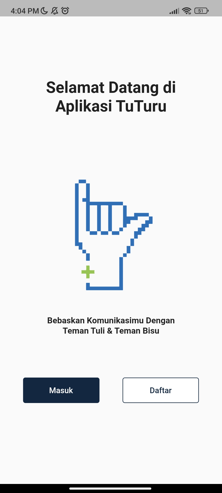
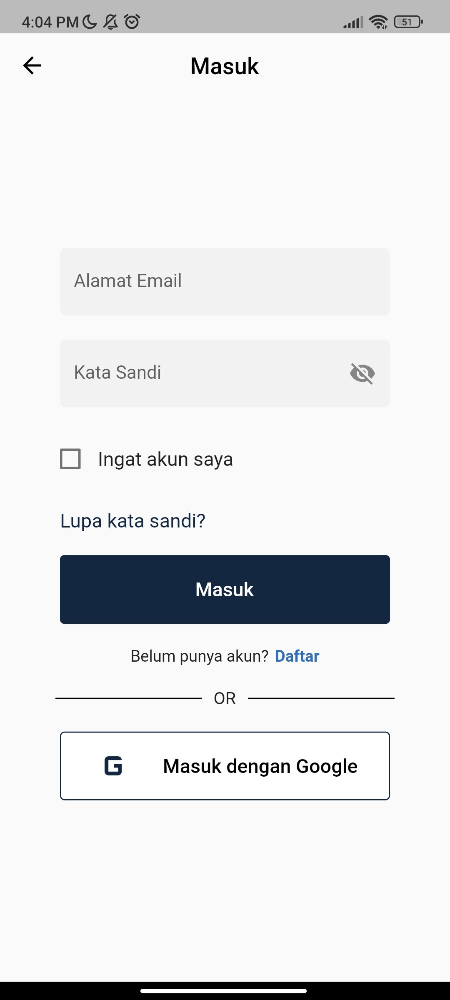
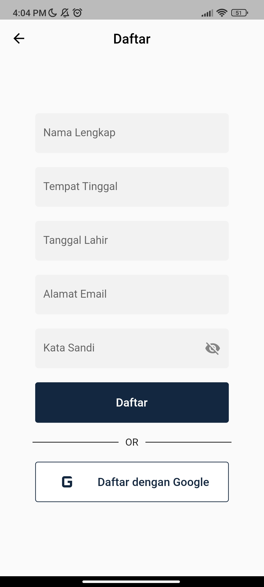
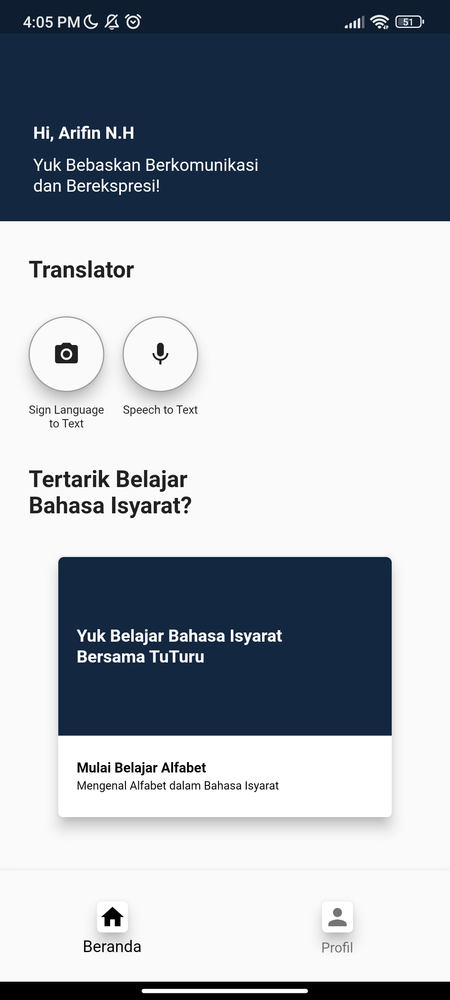

# tuturu
### Table of contents
- [Screenshots](#screenshots)
- [Team Description](#team-description)
- [System requirements](#system-requirements)
- [Application structure](#application-structure)
- [Libraries and tools used](#libraries-and-tools-used)
- [Support](#support)

### Screenshots

 |  |  |  | 
---|---|---|---|---

### Team Description

**Team Name:** Penebar Kindness

**Team Members:**
- Muhammad Fikri Firdaus (Hipster)
- Naufal Rizki Saputra (Hustler)
- Arifin Nurmuhammad Haris (Hacker)
- Syariful Hanif Setiawan (Hacker)

### System requirements

Dart SDK Version 2.18.0 or greater.
Flutter SDK Version 3.3.0 or greater.

### Application structure
After successful build, your application structure should look like this:
                    
```
.
├── android                         - It contains files required to run the application on an Android platform.
├── assets                          - It contains all images and fonts of your application.
├── ios                             - It contains files required to run the application on an iOS platform.
├── lib                             - Most important folder in the application, used to write most of the Dart code..
    ├── main.dart                   - Starting point of the application
    ├── core
    │   ├── app_export.dart         - It contains commonly used file imports
    │   ├── constants               - It contains static constant class file
    │   └── utils                   - It contains common files and utilities of the application
    ├── presentation                - It contains widgets of the screens
    ├── routes                      - It contains all the routes of the application
    └── theme                       - It contains app theme and decoration classes
    └── widgets                     - It contains all custom widget classes
```

### Libraries and tools used

- flutter: sdk: '>=3.1.4 <4.0.0'
- cached_network_image: ^3.3.0
- flutter_svg: ^2.0.9
- intl: ^0.18.0
- get: ^4.6.6
- camera: ^0.10.5+9
- firebase_auth: ^4.16.0
- google_sign_in: ^6.1.6
- logger: ^2.0.2+1
- cloud_firestore: ^4.14.0

### Support

-
